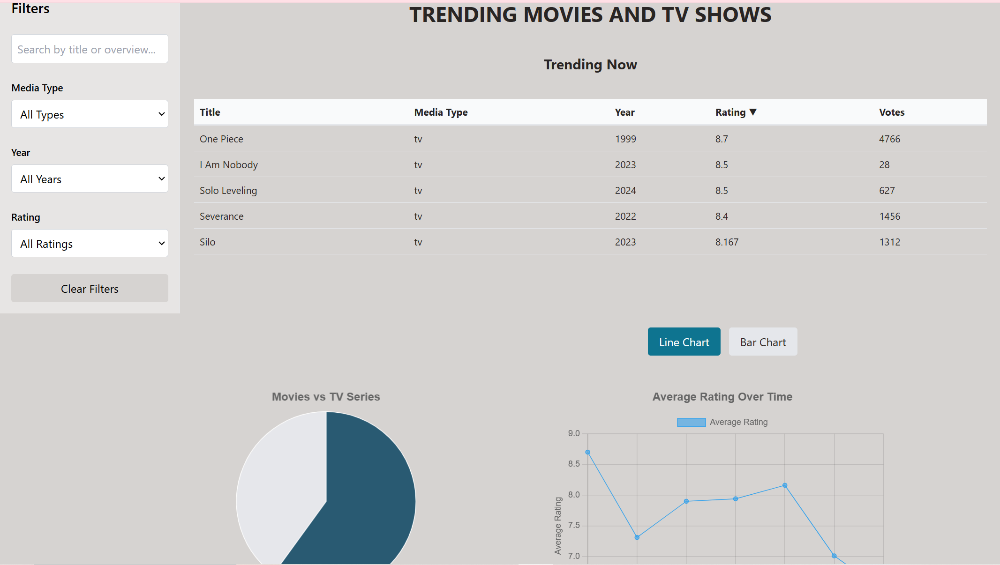
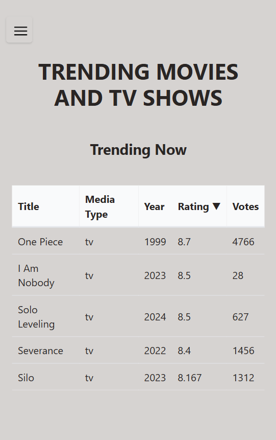
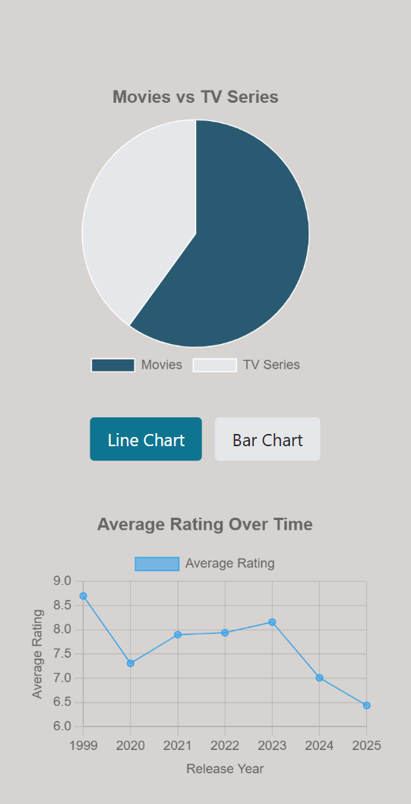

# TRENDING MOVIES AND TV SHOWS

## Description
This project is a dynamic dashboard showcasing trending movies and TV shows. It provides various visualizations and tools to explore trending content, including tables, charts, and interactive search features.

## Live Demo
Check out the live demo of the application: [Trending Movies and TV Shows Dashboard](https://movie-dashboard-flfx.onrender.com/)


## Features
- **Top 5 Movies and TV Shows Table**: Displays a ranked list of the top 5 trending movies and TV shows with key details.
- **Pie Chart**: Visualizes the distribution of trending movies vs. TV shows.
- **Search and Filters**: Enables users to search for specific titles and apply filters based on Media Type, release dates, and ratings.
- **Line Chart**: Represents trends for ratings over time.
- **Bar Chart**: Highlights average ratings of movies and TV shows over time.

## Technologies Used
- **React**: For building the user interface.
- **Tailwind CSS**: For styling the application.
- **Chart.js & react-chartjs-2**: For creating charts and visualizations.
- **Axios**: For fetching data from APIs.


## Installation and Setup

1. **Clone the repository:**
   ```bash
   git clone https://github.com/omar-alrihily/dashboard_app.git
   ```

2. **Navigate to the project directory:**
   ```bash
   cd dashboard-app
   ```

3. **Install dependencies:**
   ```bash
   npm install
   ```

4. **Start the development server:**
   ```bash
   npm start
   ```

5. Open your browser and navigate to `http://localhost:3000`.

## Screenshots

### Dashboard Overview  


### Table


### Charts and Tables



---
Feel free to reach out for any feedback or improvements!
